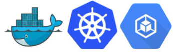

[![Stargazers][stars-shield]][stars-url]
[![Issues][issues-shield]][issues-url]
[![LinkedIn][linkedin-shield]][linkedin-url]


<!-- PROJECT LOGO -->
<br />
<div align="center">
  <a href="https://github.com/ibrahimakkaya/hello-world-devops">
    
  </a>

  <h3 align="center">hello-world-devops</h3>

  <p align="center">
    This project is a simple Node.js app, demonstration of DevOps practices, showing the usage of Docker and deployment of a basic application using Google Cloud Platform (GCP) services and Kubernetes.


    
  </p>
  <a href="https://github.com/ibrahimakkaya/hello-world-devops/blob/main/README.md"><strong>Explore the docs »</strong></a>
    <br />
    <br />
</div>
<br />
    


<!-- GETTING STARTED -->
## Getting Started

To get started with the Hello World DevOps project, follow the steps below. These instructions will guide you through the setup process and demonstrate how to deploy the sample application on Google Cloud Platform using Docker and Kubernetes.


### Prerequisites

Before proceeding with the Hello World DevOps project, ensure that you have the following prerequisites in place:

- **Google Cloud Platform (GCP) Account**: You should have a Google Cloud Platform account. If you don't have one, you can sign up with this link: [Google Cloud Console](https://cloud.google.com/console).
- **Google Cloud SDK**: Download Google Cloud SDK to run "gcloud" commands [Google Cloud SDK documentation](https://cloud.google.com/sdk/docs/quickstarts).
- **Git**: Make sure you have Git installed on your local machine. You can download Git from the [official Git website](https://git-scm.com/downloads).
- **Docker**: Install Docker on your local machine. Docker will be used to build and create containers for the app. You can download Docker from the [official Docker website](https://www.docker.com/get-started).


---


### Installation


1. Clone the repo
   ```sh
   git clone git@github.com:ibrahimakkaya/hello-world-devops.git
   ```
2. Change folder
   ```sh
   cd hello-world-devops
   ```
3. We will make some changes in files, but we will do this in the deployment part.

<p align="right">(<a href="#readme-top">back to top</a>)</p>


<!-- Dockerize and Deploy -->
## Deployment

Follow the steps below to deploy the Hello World DevOps application on Google Cloud Platform using Kubernetes:


<p align="right">(<a href="#readme-top">back to top</a>)</p>

1. Login Google Cloud and authenticate.
   ```sh
   gcloud auth login
   ```
2. Create a Google Cloud project named {PROJECT_NAME}.
   ```sh
   gcloud projects create {PROJECT_NAME}
   ```
3. To see PROJECT_ID.
   ```sh
   gcloud projects list
   ```
4. To set desired project as default.
   ```sh
   gcloud config set project {PROJECT_ID}
   ```
5. Enable the necessary Google Cloud services for this project:
   ```sh
   gcloud services enable container.googleapis.com
   ```
6. Create a Kubernetes cluster name what you want, a 1 node basic hardware:
  (This process will take a little longer, because of this prefer to do it early.)
   ```sh
   gcloud container clusters create {CLUSTER_NAME} --num-nodes=1 --machine-type=n1-standard-1
   ```
7. Create Google Cloud Artifacts with your configuration repository for store Docker image:
   ```sh
   gcloud config get-value compute/region

   gcloud artifacts repositories create {REPO_NAME} --project={PROJECT_ID} --repository-format=docker --location={REGION} --description="Docker Repo"
   ```
   
   [Difference between region and zone in Google Cloud](https://cloud.google.com/compute/docs/regions-zones)


8. Build the Docker image and push it to the Google Cloud Artifacts repository:
   (Container name can be anything you want)
   ```sh
   gcloud builds submit --tag {REGION}-docker.pkg.dev/{PROJECT_ID}/{REPO_NAME}/{CONTAINER_NAME} .
   ```
   [Build containers using gcloud build](https://cloud.google.com/compute/docs/regions-zones)

9. Open downloaded repository, open deployment.yaml and change the lines as they specified on comments.
   
    
  
  
3. Deploy the application using the Kubernetes manifest specified in the deployment.yaml file:
   ```sh
   kubectl apply -f deployment.yaml
   ```
3. Verify that the deployment is successful:
   ```sh
   kubectl get deployments
   ```
3. Create a Kubernetes service to expose the application:
   ```sh
   kubectl apply -f service.yaml
   ```
3. Wait until to see External IP:
   ```sh
   kubectl get services
   ```
3. You can access simple Node.js app with external IP.


<!-- CONTRIBUTING -->
## Contributing

Contributions are what make the open source community such an amazing place to learn, inspire, and create. Any contributions you make are **greatly appreciated**.

If you have a suggestion that would make this better, please fork the repo and create a pull request. You can also simply open an issue with the tag "enhancement".
Don't forget to give the project a star! Thanks again!

1. Fork the Project
2. Create your Branch (`git checkout -b feature`)
3. Commit your Changes (`git commit -m 'Add some feature'`)
4. Push to the Branch (`git push origin main`)
5. Open a Pull Request

<p align="right">(<a href="#readme-top">back to top</a>)</p>


<!-- CONTACT -->
## Contact

Halil Ibrahim Akkaya - [Medium](https://medium.com/@hibrahimakkaya)

Project Link: [https://github.com/ibrahimakkaya/hello-world-devops](https://github.com/ibrahimakkaya/hello-world-devops)

<p align="right">(<a href="#readme-top">back to top</a>)</p>


<!-- MARKDOWN LINKS & IMAGES -->
<!-- https://www.markdownguide.org/basic-syntax/#reference-style-links -->

[forks-shield]: https://img.shields.io/github/forks/othneildrew/Best-README-Template.svg?style=for-the-badge
[forks-url]: https://github.com/ibrahimakkaya/hello-world-devops/network/members
[stars-shield]: https://img.shields.io/github/stars/othneildrew/Best-README-Template.svg?style=for-the-badge
[stars-url]: https://github.com/ibrahimakkaya/hello-world-devops/stargazers
[issues-shield]: https://img.shields.io/github/issues/othneildrew/Best-README-Template.svg?style=for-the-badge
[issues-url]: https://github.com/ibrahimakkaya/hello-world-devops/issues
[linkedin-shield]: https://img.shields.io/badge/-LinkedIn-black.svg?style=for-the-badge&logo=linkedin&colorB=555
[linkedin-url]: https://www.linkedin.com/in/hibrahimakkaya/

